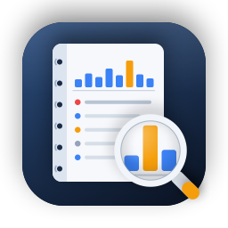

<p align="center">
  
</p>

# DayBookEvtxMacOS

**English** · [Русский](README.ru.md) · [Documentation](https://thxstuck.github.io/DayBookEvtxMacOS/en/) ·
[Download](https://github.com/thxStuck/DayBookEvtxMacOS/releases/latest)

A native macOS app for viewing and analysing Windows event logs (`.evtx`), SIEM-style. Pick a folder
with logs (for example `C/Windows/System32/winevt/logs` from a triage collection) — every file is
parsed into a case, and you get fast search, click-to-filter, a timeline, a registry of hosts and
users, logon sessions, process trees and Sigma detections.

## Features

- **Own EVTX parser** (Swift, no external libraries): every physical chunk, not only those listed in a
  stale header; CRC checks; recovery of deleted records from slack space with a `carved` flag; copies
  of one record (live log, VSS, slack) merged into one event that lists every location.
- **DQL query language** in the style of PDQL/KQL:
  `EventID = 4624 and LogonType in (3, 10) | group by IpAddress`. Queries run as set operations and
  never become SQL.
- **Click-to-filter** on any value in the table, the details or the sidebar.
- **Display time zone** — UTC±HH:MM or IANA, for reports; time is stored in UTC.
- **Timeline** of the selected logs, a time histogram, bookmarks and notes.
- **Logs** — one log at a time, like Windows Event Viewer.
- **Registry of hosts, users and IPs** with links, **logon and RDP sessions**, **process trees**
  (Sysmon by ProcessGuid, Security 4688 by PID — the heuristic is marked).
- **Sigma detections**: 2,748 bundled SigmaHQ and Hayabusa rules plus your own rules folder. Every rule
  becomes DQL you can see and run by hand; unsupported rules are listed with the reason.
- **Export** to CSV, CSV for Excel (formula-safe), JSON Lines and XLSX — time in the chosen zone and
  UTC, source file, RecordID and the file's SHA-256.
- **Transparency**: heuristics, skips, limits and recovered data are always marked.
- Russian and English user interface.

Source files are opened read-only and never modified.

## Requirements

- macOS 14 or later; built and tested on Apple Silicon (an Intel build has not been tested).
- To build: Xcode with Swift 6 (tested with Xcode 27 on macOS 26).

## Download

The ready build for Apple Silicon is in [Releases](https://github.com/thxStuck/DayBookEvtxMacOS/releases/latest).
Unzip it and move `DayBookEvtxMacOS.app` to Applications.

The app is signed locally (ad hoc) and is not notarized by Apple, which needs a paid Developer ID.
macOS therefore refuses to open it the first time: close the warning, then System Settings →
Privacy & Security → Open Anyway (an administrator password is required). Or in Terminal:

```bash
xattr -dr com.apple.quarantine /Applications/DayBookEvtxMacOS.app
```

The interface follows the system language; change it in the app with DayBookEvtxMacOS → Interface
Language. Help → DayBookEvtxMacOS Help opens the full documentation offline.

## Build and run

```bash
scripts/build.sh
open build/DayBookEvtxMacOS.app
```

Or open `DayBookEvtxMacOS.xcodeproj` in Xcode and press ⌘R. If `xcode-select` points to the Command
Line Tools, the script uses `DEVELOPER_DIR=/Applications/Xcode.app/Contents/Developer` by itself.

## Documentation

Full documentation in English and Russian is at
[thxstuck.github.io/DayBookEvtxMacOS](https://thxstuck.github.io/DayBookEvtxMacOS/en/): cases and
import, working with events, the complete DQL reference, entities, sessions and processes, Sigma
detections, export, how the app works, FAQ. The page sources are in [`docs/`](docs/).

## Command-line tool

`Packages/DaybookKit/.build/release/evtxdump` (built by the same script):

```bash
evtxdump ingest case.daybook /path/to/winevt/logs     # import into a case
evtxdump dql case.daybook 'EventID = 4625 | group by IpAddress'
evtxdump sigma case.daybook --pack DayBookEvtxMacOS/Resources/Rules/rules.json
evtxdump export case.daybook out.xlsx 'EventID = 4688'
evtxdump stats /path/to/logs                           # state of files and chunks
```

## Structure

```
DayBookEvtxMacOS/            the app (SwiftUI + AppKit), RU/EN localization
Packages/DaybookKit/
  Sources/EvtxCore/          EVTX and BinXML parser
  Sources/DaybookStore/      case store (SQLite), DQL, entities, sessions, processes, export
  Sources/DaybookSigma/      Sigma rule parsing and compilation, engine check
  Sources/evtxdump/          CLI
scripts/                     build, rule packing, icon, string sync, help book (make_help.py)
docs/                        documentation site (GitHub Pages), RU and EN
```

## License

All rights to the app's code belong to the author — see [LICENSE](LICENSE). You may not modify or
distribute the code without permission. **Issues are welcome**: bugs, ideas, questions.

Third-party components keep their own licenses:
- [SigmaHQ](https://github.com/SigmaHQ/sigma) and
  [Hayabusa](https://github.com/Yamato-Security/hayabusa-rules) rules —
  [Detection Rule License 1.1](DayBookEvtxMacOS/Resources/Rules/DRL-1.1.md);
  the author of every rule is stated in the rule and shown in the app next to every match;
- [Yams](https://github.com/jpsim/Yams) — MIT.
